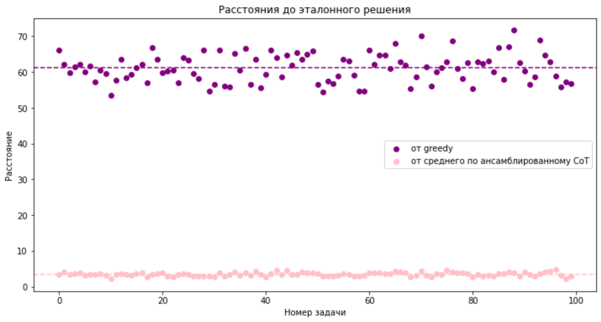

# Cравнение CoT и ансамблированного CoT на GSM8K с BLOOM-7B 

В рамках данного проекта я привела сравнение результатов генераций CoT и ансамблированного CoT для модели BLOOM-7B. 

>Я решила использовать модель BLOOM-7B вместо BLOOM-176B, так как последняя была очень долгое время недоступна из-за технических проблем, из-за чего было невозможно сгенерировать достаточно данных.
> 

Модель BLOOM-7B имеет относительно малый масштаб, особенно для сложных задач в области машинного обучения. Однако, несмотря на это, модель все же продемонстрировала некоторую эффективность в решении поставленной задачи. Мне удалось сгенерировать по 15 сэмплов для 100 задач. Конечно, это недостаточное количество для статистически значимого анализа, но исследование на этих данных оказалось весьма интересным.

 

# Результат:

###  В ходе экспериментов greedy-алгоритм сгенерировал правильный ответ в 2 из 100 случаев. В то же время, ансамбль сгенерировал правильный ответ в 13 задачах (среди всех сэмплов), среди которых лишь один оказался самым частым (среди 15 соответствующих сэмплов).

Тем не менее, если посчитать расстояния сгенерированных ответов до настоящего решения (по евклидовой метрике, с помощью SBERT - модели для генерации векторных представлений предложений и текстов), то получается, что ансамблированный CoT **в среднем** дает более близкое к ответу решение:

\
(Если бы возможно было "слепить" среднее решение из рассуждений модели, то оно бы оказалось очень близко к эталонному :sparkles:)
 

>Для сравнения небольших моделей (для greedy-метода) можно составить следующую статистику:
>| Модель | Accuracy | 
>| -------- | ------- |
>| LaMDA 8B | 1.6 | 
>| GPT 6.7B | 2.4 |
>| PaLM 8B | 4.1 | 
>| BLOOM 7B| 2 | 

(для относительно небольших моделей я не нашла статистики для self-consistency)

 

# Метрика отбора и "что еще можно сделать"?

Как было частично отмечено выше, можно векторизовать решения с помощью предобученной NLP-модели (например, SBERT) и тогда, помимо выбора лучшего ответа путем максимизации частоты его встречаемости среди сэмплов, можно попробовать выбирать ответы следующим образом:
* ### **Для небольшой модели:**
>Так как вероятность того, что ответы будут повторяться мала, то можно рассматривать те решения, которые наиболее близки по евклидовой метрике к среднему решению.\
(мы видели, как среднее решение близко к эталонному даже для небольшой модели, поэтому логично было бы предположить, что сгенерированное решение, близкое к среднему, имеет бóльшую вероятность на успех чем случайно выбранное)
 
* ### **Для большой модели:**
>В предположении, что большая модель будет давать кластеры решений с одинаковым ответом в каждом кластере, можно выбирать тот кластер, в котором дисперсия векторов-решений будет наиболее высока: это соответствует той логике, что если ответ верный, то к нему можно прийти различными способами, что как раз соответствует большой дисперсии кластера. Сравнивать таким образом стоит кластеры с максимальным количеством элементов (наиболее часто повторяющимися ответами)

В целом, эксперименты показывают, что даже такая маленькая модель, как BLOOM-7B, может дать достаточно любопытные результаты :)

 

## :pig: О трудностях:

_Пока BLOOM-176B функционировала, я сделала несколько попыток генерации решений с её помощью. В отличие от BLOOM-7B, тексты, сгенерированные BLOOM-176B, были более похожи на человеческие. Но время генерации решений с использованием этой модели было очень долгим (одно решение генерировалось более пяти минут, а это слишком медленно для решения задачи с помощью ансамблированного СоТ)_

_Также я пыталась генерировать решения с использованием huggingface inference-API, однако, там существует очень маленький лимит бесплатных генераций, что сильно усложнило процесс._

_Работа с моделью более всего была затруднена техническими ограничениями Google Colab: ограничением времени использования GPU и необходимостью переключения между аккаунтами (даже для каких-то 100 задач мне потребовалось создать 15 гугл-аккаунтов), поэтому для полноценного исследования необходима (возможно удаленная) машина с GPU._
